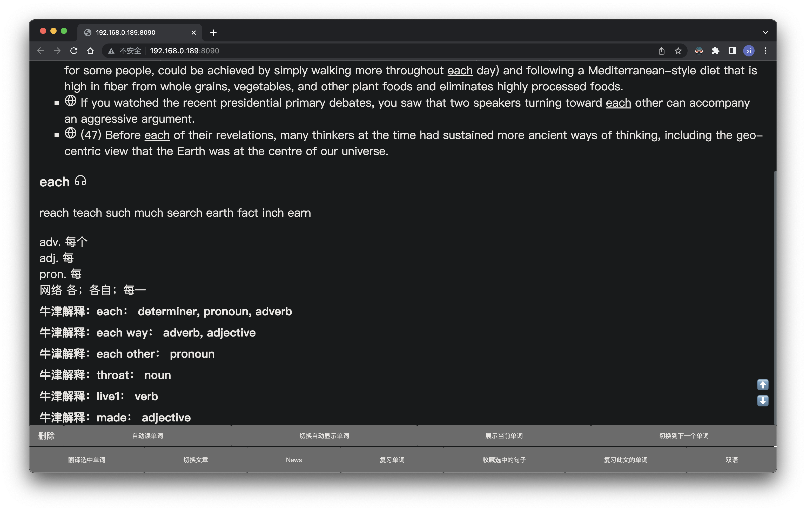

# 以文章为主的英语学习程序
我自己英语比较弱，寻找了很多学英语的方法。我发现以文章为单位记忆单词比较有效，怎么说呢，就好比你说某个词，你总是能快速地联想到和这个词相关联的东西，那是因为这个词你是从这些关联物学来的。

想必也没有谁是先学完词才会说话的吧，是因为有交流的需求才规范化了文字。

这些是我自身的一些理解，并无肯定的意思。

由于是web服务，故也能很好地用于任何支持现代web服务的设备，如我有一块墨水屏，在这方面很起作用：


# 功能有哪些？
主要功能就是，双语阅读，以及查词时，自动检索出该词出现在你学过的文章中的那些地方。

每个句子左上角都有个“球型“符号，点击就可翻译当前句子，每个单词都可点击后直接翻译。

收录了牛津词典，在单词解释页下方可以点击查详情。

在单词解释页会根据“最短编辑距离”算法列出前十个写法上相近的词。

# 怎么添加文章
在 static_source/articles/articles 目录下放入你的文章，然后将文件名按照JSON的语法规则添加到 static_source/articles/catolog.json 下

# 如何运行？
运行本程序需要你的电脑安装有 python3.x 版本，以及 nodejs

安装python所需依赖
```
python -m pip install flask flask_cors
```

进入nodejs文件夹执行以下指令：
```
npm install
```

然后回到项目的根目录下，执行以下指令：
```
python index.py
```
打开 localhost:8090 即可访问程序

# 部署到云服务
你如果有足够的money，可以租一台云服务器，部署上去，这样体验就很不错。

# 部署到闲置手机
我就是这样做的，我有一部废旧的安卓手机和一部闲置的iphone SE，然后我将程序部署上去了，这样白天12小时用手机运行，可以节省不少电费 ^V^。

**怎么部署到手机**？有些许困难。我简单叙述下我部署的经历。

首先我通过 iphone 上有一款软件叫 iSH 成功运行起了python程序，但是nodejs中使用了一个库叫puppeteer，在iSH上我没能找到很好支持puppeteer的方案。

于是我开始寻找支持在手机上运行的爬虫程序，但可惜没有找到合适的。于是我想自己开发一个适用于iphone的程序，但是很麻烦要考虑不少东西，如：如何集成python到iphone程序，不然就得用xcode重写逻辑，还有如何制作iphone版的爬虫程序，都很麻烦。吐槽下，我尝试下载xcode，我的mac剩余磁盘都不够运行xcode了。

好在我的老妈还有一部闲置的安卓机，于是我开发了一个安卓版的爬虫程序，我起名叫 Android-Spider，这样用 Android-Spider 替代了 puppeteer，成功解决问题。

随后，我想将python程序植入安卓，想通过 Termux 来实现，但是这个安卓机系统只有 Android 4.4（我尝试刷机，但是不知为何就是无法电脑识别手机，所以无法BL解锁，官方卡刷包又最高只是Android 4.4，真是几经波折啊） 不支持多窗口，所以我无法同时运行 Termux 和 Android-Spider。当然可以后台运行 Termux，Android-Spider 是必须前台运行，我看了下 Termux 目前要求 Android 5 以上，同时不确定 Termux 在后台是否稳定，所以放弃了该方案。

所以我想到直接以系统进程在Android机的linux层运行python程序。Android手机一般是 arm 架构，所以需要进行交叉编译python，幸运的是有人提供了编译好了的 arm版的python，虽然我只找到 python 3.2，但是足够了。

我通过adb将python在Android手机底层运行了起来，但新的问题是我需要将flask库移植过来，好吧，新问题又出现了，折腾了很久，由于提供的arm版python3.2是精简版导致我安装不上flask，缺少一些c库，那么我需要自己交叉编译，但是这需要折腾好久，所以我放弃了。

最终，我用iphone运行python，Android手机运行Android-Spider，支撑起了整个项目。

如果你有一部 Android 5 以上的闲置手机，那么可以通过 Termux 和 Android-Spider 将项目运行在一部手机上。